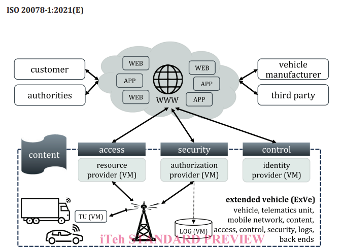
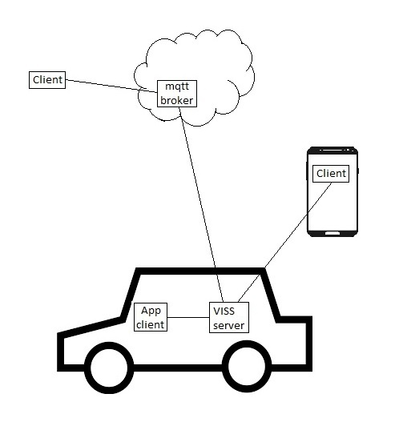
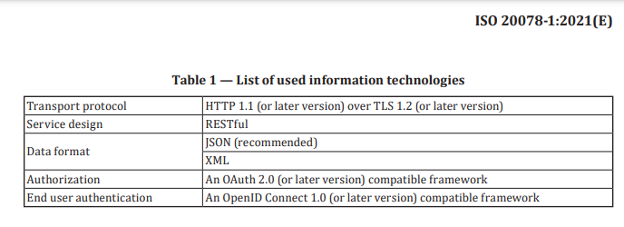

# ExVe versus VISS

* ExVe exposes an interface for access to vehicle data residing in cloud based repositories to which it is uploaded from the vehicle. See figure

* VISS exposes an interface for access to vehicle data residing in the vehicle. See figure

* VISS supports the technology components specified by ExVe. Authentication is not part of VISS scope, but ExVe authentication is compatible. See figure

