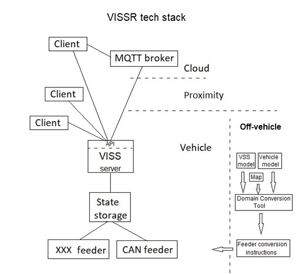

## Scenario describing COVESA VISS usage

VISS is an interface specification defining how clients can communicate with a vehicle server to access vehicle data.
To realize this a server must be implemented and integrated with the underlying vehicle system.
The following will describe how this can be done using the VISS reference implementation VISSR.\
The [VISSR Github repository](https://github.com/COVESA/vissr) contains not only a server implementation that exposes the VISS interface to clients,
but it also contains other software components (SwC) that are needed to integrate the server with the underlying vehicle system.
The figure below shows the 'VISSR tech stack', the software architecture realizing this.

### Transformation of the VSS vspec format
The VISSR server uses the [COVESA VSS signal tree](https://github.com/COVESA/vehicle_signal_specification/tree/master/spec) to validate client requests.
This validation involves checking that the requested signal is part of the tree, that the client is not trying to write to a sensor signal, etc.
The vspec format that is used at the Github is well suited for documentation of the signals as it is human readable friendly,
supports inline comments, partitioning of signals into different files, etc.
However, it is not so well suited for the programmatic processing that a server implementation will apply to it.
This is solved by using the [VSS-tools](https://github.com/COVESA/vss-tools) to transform the vspec format into another format that is compatible with what the server requires.
The VISSR server uses a binary format that is developed to support high performance traversing of the tree, etc.
One of the VSS-tools exporters is the binary exporter which is supplemented with a [binary parser library](https://github.com/COVESA/vss-tools/tree/master/binary)
that a server implementation can use to traverse the tree, access tree data, etc.
The Golang implementation of this library is used by the VISSR server together with the VSS tree transformed into the binary format.

### State storage SwC
The VISSR tech stack contains what is called a state storage.
This is a data store that contains a copy of the latest value that has been captured from any sensor or actuator that is represented in the VSS tree.
The advantage of using a state storage is that client read request do not have to propagate on the vehicle bus network all the way to the sensor/actuator
but instead it stops at the state storage. This decouples the client-server framework from the vehicle bus network when ti comes to reading of signals,
which typically is the dominant part compared to the client write requests.
It can also be used as a digital twin representation.

### Feeder SwC
One or more feeder software components are responsible for interfacing with the underlying vehicle system for reading and writing of signals,
and keeping the state storage updated.
It is also responsible for the conversion of the signals from their representation in the vehicle domain to their representation in the 'VSS domain'.
This conversion involves renaming of the signals, and sometimes also a rescaling of the signal value.
This conversion must be a high performance operation and for that reason VISSR uses an off-vehicle tool,
the [Domain Conversion Tool](https://github.com/COVESA/vissr/tree/master/tools/DomainConversionTool) to create a data structure
containing instructions for how the signals in the tree shall be converted.
The instructions support signal name remapping, signal value remapping, and signal value scaling.
The scaling support is based on a linear transformation, the value remapping enables e. g. boolean mapping between 0/1 representation to false/true representation.

### Tech stack deployment
The server, state storage and feeders are typically deployed at the 'vehicle edge',
i. e. at a high performance ECU, the telematics ECU, or any other ECU that is not too deeply embedded in the vehicle bus network.
The ECU on which it is deployed needs to have access to the all the signals represented in the VSS tree.\
The clients can s shown in the figure be deployed at different conceptual touch points.
* In-vehicle: The client is then typically implemented as an app in e. g. the infotainment environment.
* In-proximity: The client is then typically implemented as an app in e. g. a mobile phone,
and it is within the vehicle connectivity range for short range communication technologies such as Bluetooth, WiFi, etc.
* In-cloud: The client is then typically deployed at the cloud edge serving as a front-end for other back-end services.

VISSR supports multiple transport protocols of which some may be better suite for certain client deployments.
The Unix domain sockets transport protocol may e. g. be preferable for in-vehicle deployments where a protocol network stack may be unnecessary.
The MQTT transport protocol may be preferable for in-cloud deployments as it has a built-in mitigation to the 'subnet gateway' issue that other protocols may be subjected to.
